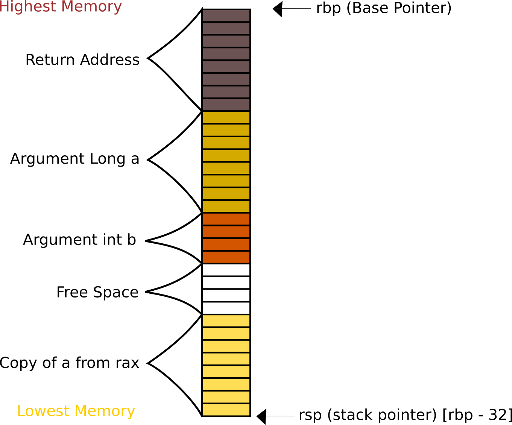
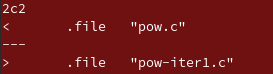
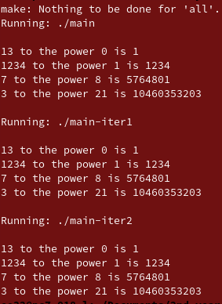

# Week 5 Practical Report

## Part 1

This was compiled via ssh. `Lyrane`on Fedora 9 and Clang 9.



Each block represents 1 byte of space.

All commands that involve use of q suffix (quadword) are (8 bytes) 64 bit values and are given to all variables of type long (e.g. argument a). All commands that use of l suffix (doubleword) involve int values are (4 bytes) 32 bit values and are given to all variables of type int (e.g. argument b). This is because size of int is 4 bytes and size of long is 8 bytes in C.

There is 4 bytes of free space from [rbp - 24]. Each address has to be a multiple of 8 so this address is keep free for alignment, since this is a 64-bit registers were used.

## Part 2

This was the iterative method developed.

```c
long power(long a, int b) {
  long total = 1;
  while (b != 0) {
    total = total * a;
    b--;
  }
  return total;
}
```


It was found that the was not difference in the core assembly of both files. The only difference was line 2 as shown below.

Command:

```bash
diff pow1.s pow-iter1.s
```

Result:



## Part 3



### Loop unrolling

The compiler makes use of loop unrolling in optimisation level 2. A space-time trade off. Loop enrolling replicates the body of the loop a certain amount of times. The amount of times it is replicated is sometimes known as the loop unrolling factor. In this optimised version by `clang` an unrolling factor of 8 is used. The control flow in the program works by first determining if the remaining times the loop needs to run is greater than 8 it runs an unrolled loop with unrolling factor 8. So the power it calculated basically as `total *= a^8`. Since `total *=a` is done 8 times. This repeats to the number of times the loop needs to run is less than 8 then it checks if the loop is equal to zero and keeps does the loop `total *= a` until loop counter is 0. 

#### Advantages

* Statements can be executed in parallel if they are not dependent on each other.
* Branch penalty is minimised; e.g. not knowing which branch you are going to before code runs.

#### Disadvantages

* increases program code size; can affect performance as increased instruction cache misses. 
* Code is less readible
* If an unrolled loop contains branches it may be even slower than recursion.


| addressing modes         | meaning                                                      |
| ------------------------ | ------------------------------------------------------------ |
| Register addressing      | the register contains the operand                            |
| Immediate Addressing     | one of the operands is a signed constant                     |
| Direct Memory Addressing | The offset value is specified directly. Usually in variable name. |

## Part 4

Comments have been written on the arm file.

To refer to 64 bits of register `x0` would be used. To refer to 32 bits of register `w0` would be used.

| Register  | purpose                                                      |
| --------- | ------------------------------------------------------------ |
| `x0`-`x7` | Arguments and Return Values                                  |
| `x9`      | Temporary stores                                             |
| `xzr`     | Zero (dummy register for the value zero). No need to set value of actual register to zero and this can be referenced instead for faster operation. |
| `x30`     | return address                                               |
| `sp`      | stack pointer                                                |
| `x29`     | frame pointer (base pointer in `x86`)                        |
| `x8`      | indirect result                                              |

assume `x0 = 1`, `x1 = 2`, `x2 = 3`. assume `x4` stores an address.

| Command | purpose                                                      |
| ------- | ------------------------------------------------------------ |
| `stp`   | Stores pair of registers. in specified location              |
| `ldp`   | Loads pair of registers.                                     |
| `stur`  | Stores registers (unscaled offset). stores a value from an address plus an offset to a set. It is possible to do displacements that aren't a multiple of 4 or 8. |
| `ldur`  | Loads  registers (unscaled offset). Loads a value from an address plus an offset to a set. It is possible to do displacements that aren't a multiple of 4 or 8. |
| `mov`   | Sets the value in one register to the same value of operand e.g. `mov x3, x2`is the same as `x3 = r2` or `x3 = 3` |
| `sub`   | Sets the value in one register to be the value of 1 operand subtracted from another e.g. `sub x3, x2 , x1` is the same as `x3 = x2 - x1` or `x3 = 3 - 2` |
| `mul`   | Multiplies value of 2 operand and stores them in register e.g. `mul x3, x1, x0` is the same as `x3 = x1 * x0` or `x2 = 2 * 1` |
| `cbnz`  | Conditional branches if the value of a register if not equal to zero. `cbnz x0, .Label` is same as `Goto .Label if  x1 != 0` or in this case since `x0 = 1` it would go to the label. |
| `orr`   | bitwise or. Sets the value of register to 0 if operands are not equal and 1 if equal. e.g. `orr x3, x2, x1` the value of `x3` is now `0`. Since they are not equal. |
| `ldr`   | `ldr x3, [x4]` the value stored in address in `x4` is set to value of `x3`. |
| `str`   | `str x2, [x4]` the value of `x2` is stored at the address found in `x4` |

| Addressing Mode                               | how it works                                                 |
| --------------------------------------------- | ------------------------------------------------------------ |
| Register Direct                               | Operand is stored in register. `mov x0, x1`                  |
| Register Indirect                             | The location of an operand is held in a register. `mov x0, [x1]` |
| Post-Index (Register indirect post-increment) | Accesses the operand at the location pointed by the base register then increments the base register. `ldr x0, [x1, #4]` |
| Pre-index (register Indirect post-increment)  | A  pointer register is used to hold the base address. An offset is added to achieve effective address. `ldr x0, [x1], #4` |


## References

1. https://azeria-labs.com/assembly-basics-cheatsheet/ used for understanding assembly commands purpose in Part 4

2. https://infocenter.arm.com/ used for understanding purpose of assembly commands and purpose of registers in registers and the different addressing modes.
3. https://courses.cs.washington.edu/courses/cse469/18wi/Materials/arm64.pdf used for understanding assembly in arm for part 4.
4. https://www.geeksforgeeks.org/loop-unrolling/ used for understanding loop unrolling and the advantages and disadvantages of loop unrolling.

5. https://www.tutorialspoint.com/assembly_programming/assembly_addressing_modes.htm used for understanding addressing modes of x86.

6. http://www.cs.uregina.ca/Links/class-info/301/ARM-addressing/lecture.html understanding addressing modes of arm.